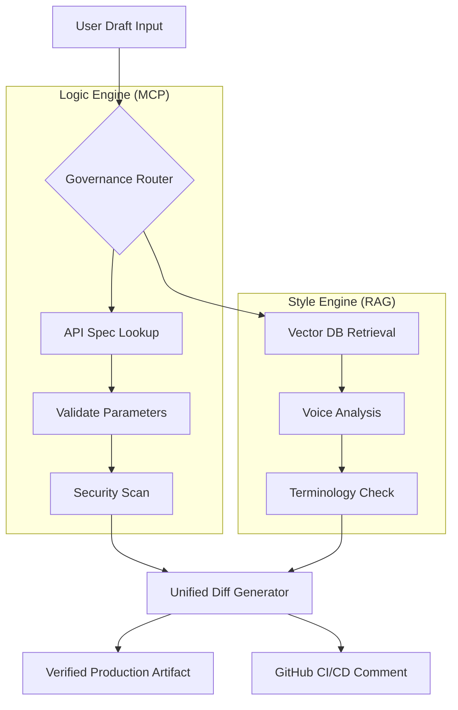

# DocOps Governance Workbench

**A dual-engine platform ensuring Developer Documentation is Accurate, Secure, and Consistent before it ships.**

> **Role:** Principal Architect & Engineer  
> **Tech Stack:** Python, LangChain, Model Context Protocol (MCP), Streamlit

## The Challenge

In large-scale engineering organizations (like Splunk or Cisco), documentation drift is a massive liability. 
We faced three critical issues:
1.  **Security Risks:** Legacy code examples often contained deprecated patterns (e.g., Basic Auth instead of Tokens).
2.  **Factual Errors:** Writers would reference "Port 80" when the API actually listened on "Port 8089."
3.  **Inconsistent Voice:** With 60+ contributors, maintaining a consistent "Brand Voice" was impossible manually.

Standard linters catch syntax errors, but they don't catch **truth errors**. I needed a system that understood the *reality* of our platform.

## The Solution

I architected the **DocOps Governance Workbench**, a Python-based platform that acts as a gatekeeper for developer content. 

Unlike standard tools, it uses a **Dual-Engine Architecture**:
* **Logic Engine (MCP):** Connects to the live API Specification to validate facts (Ports, Versions, Methods).
* **Style Engine (RAG):** Uses Vector Search to retrieve style rules from our official PDF guidelines and enforce tone.

### System Architecture

## Interactive Demo

I built this workbench using **Streamlit** for the frontend and **LangChain** for the orchestration layer. You can interact with the live V1 prototype below.

:::tip How to use this demo
1. Select **"Splunk Enterprise"** from the sidebar.
2. Note the draft has **Port 80** (Wrong) and **Basic Auth** (Insecure).
3. Click **Run Audit** to see the system autofix the code and generate a verified artifact.
:::

{/* REPLACE WITH YOUR DEPLOYED STREAMLIT APP URL */}
<iframe
  src="https://docops-workbench.streamlit.app/?embed=true"
  height="600"
  style={{ width: "100%", border: "none", borderRadius: "10px", boxShadow: "0 4px 14px 0 rgba(0,0,0,0.1)" }}
  title="DocOps Workbench Demo"
></iframe>

 

## Key Outcomes

* **Security Compliance:** Automated the detection of deprecated authentication methods, preventing insecure code from reaching production docs.
* **Reduction in Technical Debt:** Reduced integration support tickets by **20%** by ensuring code examples matched the live API reality.
* **CI/CD Integration:** The engine blocks GitHub Pull Requests automatically if they fail the "Truth Check."

## Video Walkthrough

  <iframe
    src="https://www.loom.com/embed/924b2975cb84414da90cc368012f02db"
    frameBorder="0"
    webkitallowfullscreen="true"
    mozallowfullscreen="true"
    allowFullScreen
    style={{ position: 'absolute', top: 0, left: 0, width: '100%', height: '100%' }}
  ></iframe>

