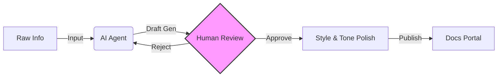

# IX AI Council: Operationalizing GenAI Strategy

**Founding a strategic governance body to transition an Information Experience (IX) organization from "AI Anxious" to "AI Adoption."**

> **Role:** Founder & Council Lead 
> **Focus:** Change Management, Tool Governance, Workflow Integration 
> **Impact:** Upskilled 60+ Technical Writers & integrated AI into standard publication pipelines. 

## 📝 The Challenge: The "Wild West" of AI

When Generative AI exploded, Splunk's Information Experience (IX) organization faced a critical juncture. We needed to scale content output without adding headcount, but faced three blockers:
1.  **Fragmentation:** Individual writers were experimenting with unauthorized tools, creating security risks.
2.  **Anxiety:** The team feared displacement rather than seeing enablement.
3.  **Lack of Strategy:** We had no standard for *how* to use AI for documentation—only *that* we should.

## 🛠️ The Solution: The IX AI Council

I founded the **IX AI Council** to serve as the central governance and enablement body, bridging the gap between Engineering, Product, and Content Experience.

### 1. Governance & Tool Selection
We moved from ad-hoc usage to a sanctioned tech stack.
* **Evaluated:** Audited enterprise tools against security and style requirements.
* **Defined:** Created the "Red/Yellow/Green" usage policy for data handling (e.g., "No proprietary code in public LLMs").

### 2. Prompt Engineering Library
I architected a shared library of system prompts stored in Git, allowing writers to treat prompts as code. This standardized the output tone and ensured consistent results across 60+ staff members.

### 3. The "Human-in-the-Loop" Framework
To quell anxiety and ensure quality, I architected a workflow where AI is the *drafter* and the Human is the *editor/publisher*.

### 4. 📊 The Impact (Ongoing)
The Council transformed our documentation culture:

**Velocity**: Increased content velocity by **25%** via GenAI workflows.

**Efficiency**: Reduced audit time by **40%** using internal LLMs to automate style reviews.

**Adoption**: 100% of the team was part of the "Human-in-the-Loop" workflow.

**Safety**: Zero legal or compliance incidents during the pilot phase.