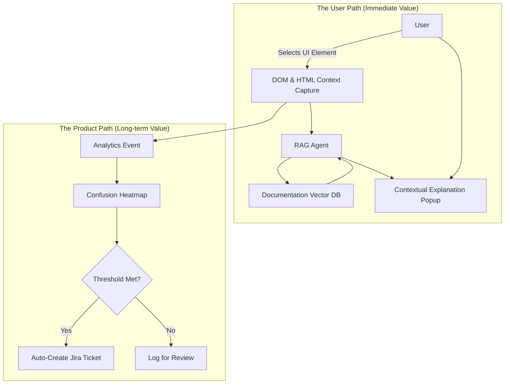

# Project SAGE: AI-Driven UX Optimization

**"Selection Agent with Guided Explanations" — An award-winning AI framework that turns user confusion into actionable product insights.**

> **Role:** Product Manager & Lead  
> **Recognition:** 🏆 People's Choice Award & 2nd Place Overall (AI Hackathon)  
> **Team:** Cross-functional leadership (Engineering, UX Research, Product Design, Tech Writing)

## The Problem: "Paper Cuts" in the Workflow

In complex enterprise dashboards, users often encounter metrics, charts, or abbreviations they don't understand. We call these "Paper Cuts."

When a user is confused, they usually:
1.  **Break flow:** Open a new tab to search documentation.
2.  **Context switch:** Ping a teammate on Slack.
3.  **Give up:** Ignoring the feature entirely.

For the Product Team, this creates a **Blind Spot**. We know users are struggling, but we don't know *exactly* which UI elements are causing the friction. We rely on lagging indicators like support tickets, often weeks after the frustration occurred.

## The Solution

We built **Sage**, a visitor-driven AI framework. Instead of a generic chatbot, Sage allows users to **draw a box** around any specific element in the UI to get an instant, context-aware explanation.

But the real innovation isn't just the answer—it's the data we capture.

### The "Confusion Map" Architecture

Sage closes the loop between User Confusion and Product Improvement. Every time a user selects an area for help, we log that interaction as a "Confusion Signal."

### Visualizing Friction: The Heatmap Overlay

While the RAG Agent solves the immediate problem for the individual, the architecture simultaneously aggregates these signals for the Product Team. 

By feeding selection data into Pendo, Sage creates a **"Confusion Heatmap"** of our own product. Unlike traditional heatmaps that track clicks (engagement), this tracks *hesitation*. We can see exactly which button, label, or chart is causing the most friction, filtering out the noise to reveal high-fidelity patterns of struggle.

### Automating the Feedback Loop

The ultimate goal isn't just to answer questions—it's to eliminate the need for them. 

Sage operationalizes this insight through threshold-based logic. If a specific UI element generates a high volume of queries (e.g., "What does 'Health Score' mean?"), the system triggers an automated workflow:

1.  **Signal Detection:** The system identifies a "Hotspot" of confusion.
2.  **Context Injection:** It captures the element ID, frequency of clicks, and user query topics.
3.  **Ticket Generation:** It automatically creates a Jira ticket populated with this data.

This process removes subjectivity from prioritization. Instead of debating what to fix, the engineering backlog becomes populated with tasks that are **quantifiably proven to be high-friction**, ensuring our development cycles are always directly aligned with verified user needs.
