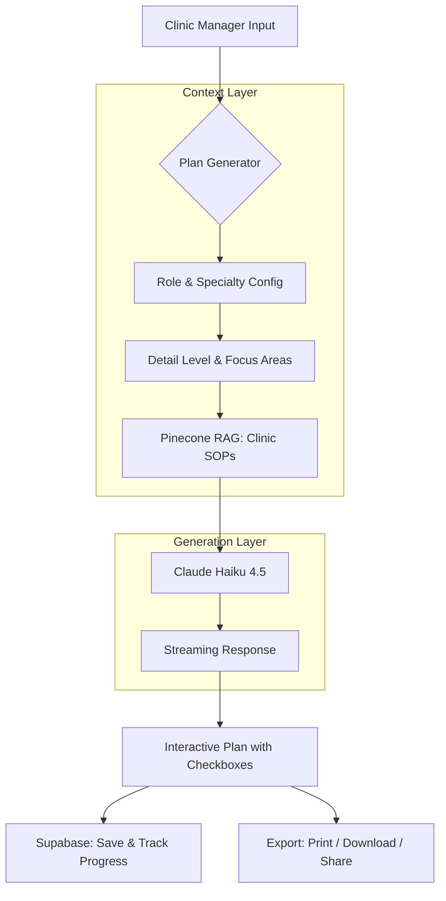

# QuickRamp

**AI-powered clinical onboarding plan generator that turns "figure it out" into structured, competency-verified training for new hires at small medical clinics.**

> **Role:** Co-founder & Engineer  
> **Tech Stack:** Next.js 16, Claude API, Pinecone, Supabase, Vercel  
> **Co-founder:** Helen Zhu, PA-C

## The Problem

Small clinics onboard new hires the same way every time: shadow someone for a week, hope they absorb enough, then throw them into patient care. There's no structured plan, no competency verification, and no way to know if the new MA actually learned the EHR workflow or just watched someone else do it.

The result:

1. **High turnover:** Medical assistants leave within 6 months because they feel unsupported.
2. **Patient safety gaps:** New hires perform tasks they were shown once but never verified on.
3. **Manager burnout:** Clinic managers spend hours writing ad-hoc training checklists that get reused poorly.

Enterprise healthcare has Learning Management Systems. Small practices have a clipboard and good intentions. We built the middle ground.

## The Solution

QuickRamp generates structured, day-by-day onboarding plans tailored to the specific role, medical specialty, experience level, and duration. Plans include daily tasks, learning objectives, competency check scenarios, and success metrics that supervisors can actually use to verify a hire knows what they're doing.

The system uses **Retrieval-Augmented Generation** via Pinecone to incorporate each clinic's own SOPs, EHR guides, and policies into the generated plans, so the output isn't generic healthcare advice but reflects how that specific clinic operates.

### System Architecture

## How It Works

The manager fills out a form: role (MA, PA, NP, Front Office, Billing, Office Manager), specialty (Family Medicine, Urgent Care, Pediatrics, etc.), experience level, and training duration. They can also adjust detail level and weight the plan toward specific focus areas like clinical skills, EHR training, or compliance.

Claude generates a structured plan with:

- **Pre-Day-1 checklist** for what to prepare before the hire starts
- **Daily breakdowns** organized by week, with focus areas, tasks, and learning objectives
- **Competency check scenarios** that supervisors can run to verify the hire actually knows the material (not just that they were shown it)
- **Success metrics** with target timelines, measurement methods, and red flags

Plans are interactive: managers check off tasks as the new hire completes them, and progress persists across sessions via Supabase.

## Key Technical Decisions

**Clinic-specific RAG with Pinecone.** Each logged-in user gets an isolated Pinecone Assistant (`clinic-{userId}`). When a clinic uploads their SOPs or EHR guides, the plan generator retrieves relevant context and weaves it into the output. A plan for a clinic running eClinicalWorks reads differently from one running Epic.

**Claude Haiku 4.5 over Sonnet.** Plan generation is a structured writing task, not a complex reasoning problem. Haiku produces plans of equivalent quality at a fraction of the cost, and the streaming response keeps the UX snappy.

**Freemium with localStorage gating.** One free plan per browser without signup, unlimited with a free account. Low-friction entry for a skeptical audience (clinic managers aren't early adopters).

## Key Outcomes

- **6 roles, 12 specialties** covered with role-specific metrics and competency scenarios
- **Sub-10-second generation** via streaming, compared to hours of manual plan writing
- **Competency verification built in:** each plan includes realistic test scenarios, not just "shadow someone"
- **Zero patient data exposure:** plans are generated without PII, enforced at the prompt level

## What's Next

QuickRamp is in validation, getting into the hands of 10-20 clinics through Helen's clinical network. The roadmap includes paid tiers with progress tracking emails, Stripe billing, and eventually a manager dashboard for overseeing multiple hires across a practice.
