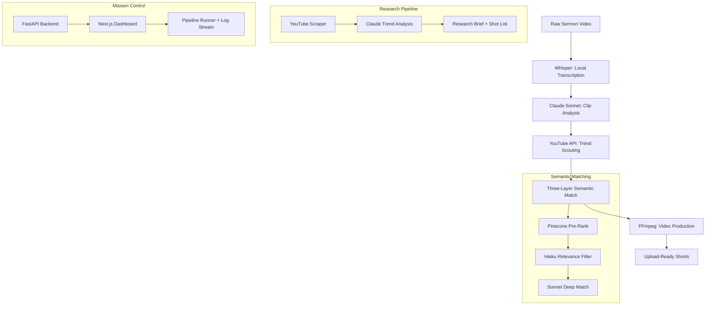

# YouTube Content Pipeline

**A full-stack AI system that turns hour-long sermon videos into trending-matched vertical shorts, and researches what to film next, all from a single dashboard.**

> **Role:** Solo Architect & Engineer  
> **Tech Stack:** Python, Claude API, Pinecone, FFmpeg, PyTorch, FastAPI, Next.js, Modal

## The Problem

A church media team wanted to grow their YouTube Shorts presence but hit three walls:

1. **Manual clip selection is slow.** Watching a 45-minute sermon to find 3-4 short-worthy moments takes longer than filming the sermon itself.
2. **Trend research is a black hole.** Scrolling YouTube to figure out "what's working right now" eats hours with nothing to show for it.
3. **No memory across weeks.** Every editing session starts from scratch. Clips analyzed last month are forgotten. Trends identified two weeks ago aren't tracked.

The team needed a system that could handle the mechanical parts of content creation so they could focus on the actual ministry work.

## The Solution

Two complementary pipelines, orchestrated from a single web dashboard:

**Sermon Shorts Pipeline** takes a raw video file and produces upload-ready vertical shorts (9:16, 1080x1920) with AI-generated titles, SEO descriptions, and styled captions. It runs in five steps: transcribe, analyze, scout trends, match clips to trends, and produce final videos.

**Viral Longform Pipeline** scrapes what's currently performing on YouTube, clusters the opportunities, and outputs a concrete filming plan with scripted hooks and talking points.

### System Architecture

## The Interesting Part: Semantic Matching

The original system used keyword matching to connect sermon clips to trending topics. It was terrible. "Trust Through Time" matched "Pizza On Time." Keywords can't understand that a clip about spiritual blindness is thematically related to a trending video about cognitive biases.

The fix was a three-layer matching system that trades off cost and accuracy:

1. **Pinecone vector pre-ranking** (cheap, fast): narrows 200+ trending shorts down to ~20 candidates per clip using embedding similarity
2. **Claude Haiku relevance filter** (cheap, accurate): kills false positives with a quick yes/no judgment
3. **Claude Sonnet deep match** (expensive, precise): scores the surviving pairs on thematic resonance, audience overlap, and content angle

This cut garbage matches to near-zero while keeping the per-run cost under $0.10.

## Technical Highlights

**Local Whisper transcription.** Runs on-device via faster-whisper instead of calling the OpenAI API. Saves $0.36 per sermon, preserves privacy, removes an external dependency.

**PyTorch face tracking.** MTCNN neural face detection tracks the speaker across frames for intelligent vertical cropping. Haar cascades failed in low-light sanctuary footage, so the system uses a deep learning approach with graceful fallback to center crop.

**Four caption styles.** Karaoke (word-by-word highlight), punch (bold emphasis), highlight (background box), and simple. Rendered as ASS subtitles and burned into the video by FFmpeg with hardware-accelerated encoding.

**Persistent memory via Pinecone.** Without it, every pipeline run starts fresh. With it, clips from last month are still queryable, cross-video deduplication works, and match quality improves over time as the system learns what pairings performed well.

**Modal cloud deployment.** Two-image strategy: a light image (~500MB) for the web API and a heavy image (~4GB) for GPU transcription. Scales to zero when idle. Symlink patching lets the same scripts run identically on a laptop and in the cloud.

## Mission Control Dashboard

The dashboard (FastAPI + Next.js 15) provides:

- **Pipeline runner** with 30+ parameter controls for each step
- **Real-time log streaming** via Server-Sent Events
- **Clip browser** and **trending shorts browser** for reviewing analysis
- **Match results viewer** showing semantic pairings with scores
- **Video gallery** for previewing produced shorts

## Key Outcomes

- **Full pipeline run: ~$0.08** (eight cents) per sermon, down from hours of manual work
- **28 production scripts** covering transcription, analysis, scouting, matching, video generation, face tracking, caption rendering, and uploading
- **Persistent semantic memory** that improves matching quality across weeks and months
- **Two-pipeline loop:** the longform pipeline tells you what to film, the shorts pipeline turns it into content, and the system remembers what worked
